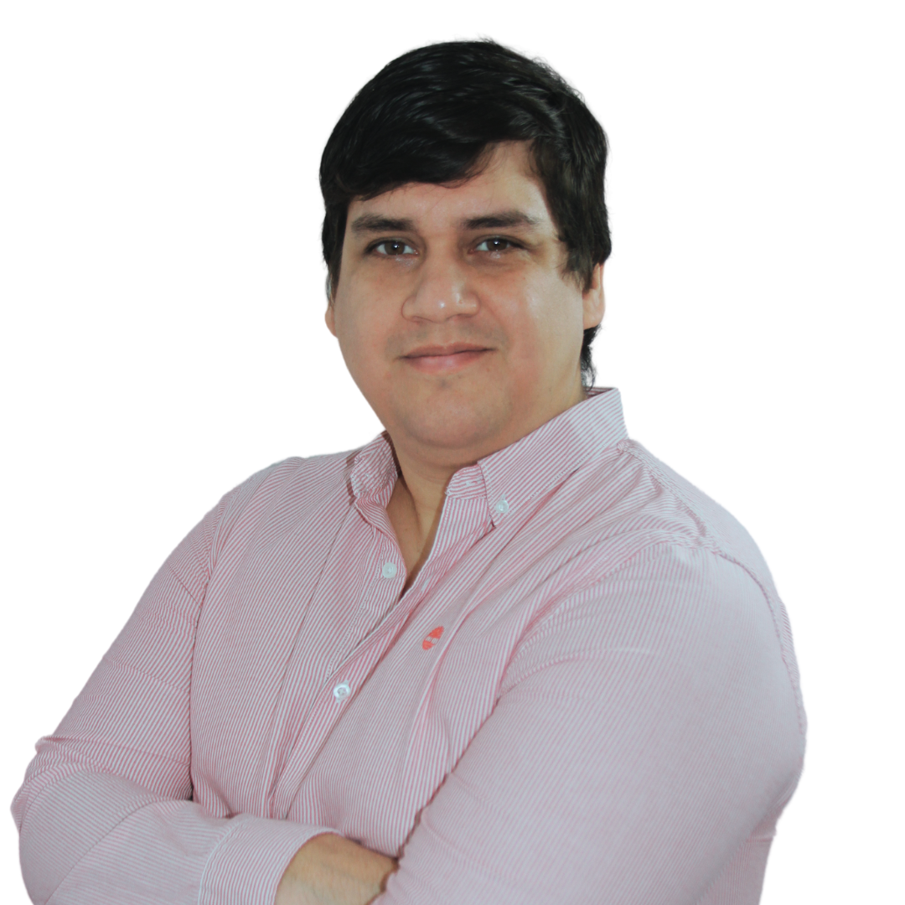

# Ramón Rodolfo Insaurralde Laneri

{width=200 height=150}

- Nationality: Paraguayan and Italian
- Address: Kennedy 510 between Cerro Corá and Azara
- City: Asunción
- ☎: (+595)982658189
- @: erreinsa@gmail.com
- in: linkedin.com/in/erreinsa

## Professional Profile

I am a serious and dynamic young man, eager to excel and improve myself. I come from a family where education, respect, and responsibility are fundamental pillars of personal and social development. I possess dynamism, fluency, and flexibility when facing interpersonal situations and teamwork. I learn very easily and consider myself a young man committed to his life and his community. I also consider myself a leader by example. I can easily identify the types of leaders so that they can coexist in pursuit of the work we need to do. I am characterized by always contributing ideas to improve work. I always seek growth from positive and negative feedback.

## Professional Experience

**2023 - Current: VIA**
*Owner*

*   AI product development, B2B sales, B2C sales, digital marketing, web development, data science. First AI chatbot oriented to sales. 4 major companies and growing.

**2022-2023: Protek S.A**
*Growth Hacker Manager*

*   Head of area, implementation of business solutions aimed at growing the BrosCo APP application for cooperatives.
*   Data analysis, Marketing, Product Design, Commercial Manager, Process Design. (101% growth compared to the 2022 goal.)

**2021-2022: BrosCo S.A**
*Growth Hacker Manager*

*   Head of area, implementation of business solutions aimed at growing the BrosCo APP application for cooperatives.
*   Data analysis, Marketing, Product Design, Product Manager, UX, UI, Project Manager, Digital Marketing. 50% growth in downloads and 20% increase in transactions in 1 year.

**2019-2021: Universidad del Pacífico (Pacific University)**
*Digital Marketing Manager*

*   Head of area, implementation of business solutions, Landings, CRM, Administration of financial resources for digital marketing campaigns, development of digital strategies, development of content strategies for networks. In charge of implementation projects for the evolution of the sales process.
*   Implementation of resource management systems. Data analysis. Web developer and digital marketing director, 95% of the marketing budget was assigned to the digital marketing area.

**2017-2018: Agencia Creativa Verba (Verba Creative Agency)**
*Executive Director and Co-founder*

*   In charge of administration and in charge of the marketing and new web project development department. Digital Marketing Agency, Design, web development, and Growth Hacking. We had an impact on 20 small and medium size companies helping them to reach their goals.

**2016-2017: INCADE S.A, Universidad Americana (American University)**
*Senior Programmer Analyst*

*   Planning, design, development, and maintenance of web-based and desktop-based computer systems. I also administer systems previously developed and used at the university. Web developer for internal products of the university. More than 4 Projects in 1 year.

**2014-2015: INCADE S.A, Universidad Americana (American University)**
*Web Master and Digital Marketing Analyst*

*   My job consisted of the administration and management by the University of its website and the data collected from digital campaigns, as well as generating digital strategies to improve the achievement of results in the area. Web developer and digital marketing manager. 1 web project administrator and record in leads in 2014, 2015 and 2016

**2014: Centro de Estudios Judiciales y Centro de altos estudios del Paraguay (Center for Judicial Studies and Center for Advanced Studies of Paraguay)**
*Head of System and Network Administrator - WebMaster*

*   My job consisted of providing server administration and administration of web platforms. Design and programming services for web applications for different projects of the two companies. System Administrator and web development at 2 NGO.

**2012-2013: Hola Paraguay S.A**
*Head of Technical Support Contact Center*

*   My job consisted of being the head of technicians in charge of providing support to users of the company Copaco S.A, regarding their technologies both internet and telephone. Manager of Technical Support Services Internet at COPACO SA. we gave support to more than 3000 customers.

**2009-2012: Programador Libre (Freelance Programmer)**
*Position: Web programmer and designer.*

*   My specific job is the reception of web projects, direct communication with the client and their requirements, for the subsequent design and programming of the website, or web project, likewise I work with programmers from other countries with whom I also carry out other web projects in parallel.

**2007-2008: Hotel Purtud- Courmayeur- Italia**
*Euroservice S.R.L- Varese-Italia*
*Front Desk, in charge of Reception, Administration.*

*   My specific job consisted of receiving and serving hotel customers, as well as the proper administration of the place, in charge of making balances on the hotel's financial movements. I was in charge of the distribution of cleaning staff and other staff adept at reception.

## Skills

**Programming & Web Development:**
*   PHP, CSS, HTML5, JavaScript, C, C#, Python
*   React.js, Node.js, .NET framework
*   PostgreSQL, MySQL, SQL Server, MongoDB, Firebase

**Data Science & Analytics:**
*   Excel, Power BI, Google Data Studio, Tableau
*   Google Analytics, Hotjar

**Growth Hacking & Marketing:**
*   Content Marketing, SEO / SEM/ASO
*   Digital Ads Management, UI/UX, Visual Design
*   Referral Programs and Viral Marketing
*   Marketing Automation tools, Behavioral Psychology
*   Ads

**Sales & Management:**
*   B2B Sales, B2C Sales
*   Recruiting and Hiring, Training
*   Performance Evaluation, Sales Group Management

**Project Management:**
*   Agile, Scrum
*   Project Management (JIRA, BACKLOG, SCRUM)

**Systems & Other:**
*   Linux, Mac, Windows
*   SAP

## Academic Background

*   Secondary: Scientific Baccalaureate. College de L'Immaculee Conception. The Humanistic Baccalaureate directed to Science and Mathematics.
*   2011-2017: Computer Engineering. Catholic University Our Lady of the Assumption.
*   2007-2008: Computer Engineering. Polytechnic di Milano (Milan-Italy). Studied Computer Engineering in said location for 2 years.

## Languages

*   Spanish: Reading, writing and speaking: Native language
*   Guaraní: Reading, writing and speaking: Intermediate
*   Italian: Reading, writing and speaking: Advanced.
*   English: Reading: Advanced; writing and speaking: Intermediate.
*   Portuguese: Basic.
*   French: Basic.

## Courses

*   Mobile Application Development on Android platforms, University of Maryland - USA (Coursera)
*   Digital Marketing course on mobile devices for programmers. (GOOGLE).
*   International Certification in data science from John Hopkings University - USA (coursera).
*   Data Analyst Course (Data Science Course) - Catholic University of Asunción.
*   SAP basic operator course.
*   Digital marketing courses in Facebook Blueprint.
*   Digital marketing courses at google partners.
*   Computer systems network administration courses 1 and 2 - Catholic University of Asunción.
*   Data Science course with a social objective Catholic University of Asunción.
*   Digital marketing courses in Google Ads Academy.
*   Growth Hacking course for small and medium businesses.
*   SEO, SEM 2023 Courses
*   Sales Management Courses.

## Other Data of Interest

*   Type B driving license

## Get to Know Me More Closely

*   Athlete, I was part of the Paraguayan youth men's volleyball team at age 16, playing for the Catholic University club until 2012.
*   As a volunteer, I was part of the Paraguay Educa Foundation, in which my role was to help promote the bill that will help many children in the country access their own computer in it, I was part of the communication committee.
*   Volunteer and supermarket coordinator in the food collection campaign through the Food Bank foundation, for 6 years in different supermarkets both in Milan-Italy and in the capital of Paraguay. I am in charge of other volunteers who collect food to help more than 13,500 people eat per year.
*   Co-Founder of the American Football Association of Paraguay, coach of the Titanes de Asunción team. Coach of the Paraguayan American Football team 2018.
*   Co-Creator of the Mega Feria trade fair in Asunción. (www.megaferia.org).
*   Co-founder of VIA, a company that provides AI solutions for businesses.

## Personal and Work References

*   Liliana Barrios (Personal) +595 981 795790
*   Lic. Romina Gonzalez (Universidad Americana - Work) +595 981890401
*   Lic. Jazmin Almada (Universidad del Pacífico - Work) +595981432478
